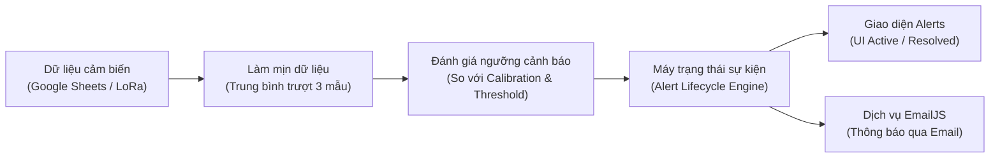
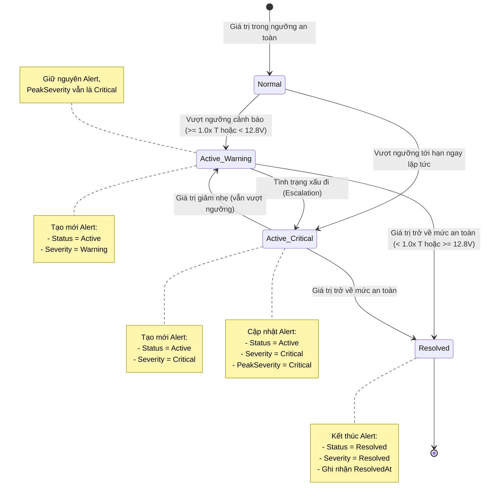

# Cơ Chế Hoạt Động Của Hệ Thống Cảnh Báo (Alert Mechanism)
> **Dự án:** Tower Inclination Monitoring System (Hệ thống giám sát độ nghiêng tháp)  
> **Tài liệu kỹ thuật:** Giải thích chi tiết thuật toán phát hiện cảnh báo, vòng đời sự kiện, trạng thái hiển thị trên giao diện và luồng thông báo EmailJS.

---

## 1. Tổng quan hệ thống cảnh báo

Hệ thống cảnh báo được thiết kế để theo dõi liên tục 2 chỉ số vận hành quan trọng của tháp / kết cấu:
1. **Độ nghiêng 3 trục ($X, Y, Z$)**: Phát hiện hiện tượng lún nghiêng, biến dạng kết cấu hoặc rung lắc bất thường.
2. **Điện áp nguồn Pin (Battery Voltage)**: Cảnh báo khi nguồn cấp sụt giảm, đảm bảo thiết bị đo không bị mất nguồn đột ngột.

### Luồng xử lý dữ liệu tổng thể:

---

## 2. Tiêu chuẩn đánh giá & Ngưỡng cảnh báo (Thresholds)

### 2.1. Góc nghiêng (Inclination)

* **Hiệu chuẩn ban đầu (Calibration):** Góc nghiêng tham chiếu $X_0, Y_0, Z_0$ khi lắp đặt tháp ở trạng thái cân bằng.
* **Làm mịn dữ liệu (Rolling Window):** Dữ liệu được tính trung bình trượt trên **3 mẫu gần nhất** (cửa sổ tối đa 90 phút). Góc quay được chuẩn hóa trong dải $\pm 180^\circ$ (`wrapDegrees180`) để tránh hiện tượng tràn góc.
* **Độ lệch thực tế:**
  $$\Delta X = |X - X_0|, \quad \Delta Y = |Y - Y_0|, \quad \Delta Z = |Z - Z_0|$$
* **Ngưỡng cho phép ($T$):** Được cấu hình cho từng trục (mặc định $T_X = T_Y = T_Z = 0.5^\circ$).
* **Hệ số nguy hiểm tới hạn:** `alertCriticalMultiplier = 1.5`.

#### Bảng phân cấp độ nghiêng:

| Mức độ (Level) | Điều kiện tính toán | Ví dụ (với ngưỡng $T = 0.5^\circ$) | Ý nghĩa thực tế |
| :--- | :--- | :--- | :--- |
| **Normal** | $\Delta < T$ | $\Delta < 0.5^\circ$ | Tháp ở trạng thái an toàn, dao động bình thường. |
| **Warning** | $1.0 \times T \le \Delta < 1.5 \times T$ | $0.5^\circ \le \Delta < 0.75^\circ$ | Tháp nghiêng vượt giới hạn cho phép, cần theo dõi sát. |
| **Critical** | $\Delta \ge 1.5 \times T$ | $\Delta \ge 0.75^\circ$ | Mức độ nguy hiểm cao (vượt $150\%$ ngưỡng), có nguy cơ sự cố. |

---

### 2.2. Điện áp Pin (Battery Voltage)

Điện áp danh định của ắc-quy/pin hệ thống được kiểm tra trực tiếp qua 2 ngưỡng:
* **Ngưỡng cảnh báo pin yếu (`warning`):** Mặc định $12.8\text{ V}$.
* **Ngưỡng xả sâu tới hạn (`critical`):** Mặc định $10.0\text{ V}$.

#### Bảng phân cấp điện áp pin:

| Mức độ (Level) | Điều kiện điện áp ($V$) | Ý nghĩa thực tế |
| :--- | :--- | :--- |
| **Normal** | $V \ge 12.8\text{ V}$ | Pin hoạt động tốt, dung lượng đủ. |
| **Warning** | $10.0\text{ V} \le V < 12.8\text{ V}$ | Nguồn pin yếu, cần kiểm tra sạc năng lượng mặt trời hoặc ắc-quy. |
| **Critical** | $V < 10.0\text{ V}$ | Pin cạn kiệt, xả sâu nguy hiểm, thiết bị sắp sập nguồn. |

---

## 3. Vòng đời sự kiện: Phân biệt `Severity` và `Status`

Trong mã nguồn (`alertProcessor.js`), cảnh báo không chỉ là một dòng log rời rạc mà được quản lý theo **phiên sự cố có vòng đời** (Lifecycle Tracking) theo từng Tháp và từng loại (`TowerID | Type`):

### So sánh chi tiết hai thuộc tính:

| Thuộc tính | Các giá trị | Vai trò & Mục đích |
| :--- | :--- | :--- |
| **Status** *(Trạng thái)* | `Active` `Resolved` | Cho biết **sự cố có còn tồn tại ở thời điểm hiện tại hay không**: • `Active`: Vấn đề vẫn chưa được giải quyết. • `Resolved`: Vấn đề đã tự phục hồi hoặc đã được xử lý về an toàn. |
| **Severity** *(Mức độ)* | `Critical` `Warning` `Resolved` | Thể hiện **mức độ nghiêm trọng** của chỉ số đo đạc: • `Critical`: Cấp độ nguy hiểm cao nhất. • `Warning`: Cấp độ cảnh báo chú ý. • `Resolved`: Cấp độ khi đã an toàn. |

---

## 4. Cơ chế hoạt động trên giao diện Alerts (Web UI)

### 4.1. Bốn thẻ số liệu thống kê (Summary Metric Cards)
* **Total alerts:** Tổng số phiên sự cố được phát hiện trong toàn bộ lịch sử đo đang hiển thị (bao gồm cả `Active` và `Resolved`).
* **Critical alerts:** Chỉ đếm các sự cố **đang diễn ra** (`Status == Active`) và có mức độ nguy hiểm (`Severity == Critical`).
* **Battery alerts:** Chỉ đếm các sự cố về pin **đang diễn ra** (`Status == Active`).
* **Inclination alerts:** Chỉ đếm các sự cố độ nghiêng **đang diễn ra** (`Status == Active`).

---

### 4.2. Bộ lọc Mức độ nghiêm trọng (Severity Filter)
Người dùng có thể chuyển đổi nhanh qua các nút bấm trên thanh công cụ:
* **All:** Hiển thị toàn bộ lịch sử các cảnh báo.
* **Critical:** Chỉ hiển thị các cảnh báo đang ở mức nguy hiểm (`Status == Active` VÀ `Severity == Critical`).
* **Warning:** Chỉ hiển thị các cảnh báo đang ở mức cảnh báo (`Status == Active` VÀ `Severity == Warning`).
* **Resolved:** Chỉ hiển thị các sự cố **đã khắc phục xong** (`Status == Resolved`).

---

### 4.3. Cấu trúc bảng lịch sử (Alert History Table)

| Cột | Ý nghĩa | Ví dụ |
| :--- | :--- | :--- |
| **Alert ID** | Mã định danh duy nhất của phiên sự cố | `ALT-3K8F1A2` |
| **Tower** | Tên trạm / tháp giám sát | `TWR-01` |
| **Type** | Loại cảnh báo kèm biểu tượng trực quan | `Battery` (Pin) hoặc `Inclination` (Độ nghiêng) |
| **Message** | Mô tả chi tiết chỉ số vi phạm | `X-axis inclination reached critical level at 0.82° (threshold 0.50°).` |
| **Time** | Thời điểm cập nhật giá trị mới nhất | `2026/10/07 08:30:15` |
| **Severity** | Huy hiệu mức độ nghiêm trọng | `Critical` (Đỏ) / `Warning` (Vàng) / `Resolved` (Xanh) |
| **Status** | Huy hiệu trạng thái xử lý | `Active` (Đang diễn ra) / `Resolved` (Đã xử lý) |
| **Action** | Nút `View` để mở rộng xem thông tin chi tiết | Xem giá trị đỉnh (`peakSeverity`), ngưỡng áp dụng, giờ bắt đầu (`triggeredAt`), giờ phục hồi (`resolvedAt`). |

---

## 5. Cơ chế gửi Email Cảnh báo (EmailJS Alert Engine)

Ngoài việc hiển thị trên giao diện người dùng, hệ thống còn tích hợp tự động gửi Email khẩn cấp qua **EmailJS**:

1. **Điều kiện kích hoạt gửi mail:**
   * Khi trạng thái chuyển từ `Normal` $\rightarrow$ `Warning` hoặc `Critical`.
   * Khi trạng thái leo thang (escalation) từ `Warning` $\rightarrow$ `Critical`.
   * (Có thể cấu hình chu kỳ gửi nhắc lại nếu sự cố vẫn tiếp diễn).
2. **Nội dung email tự động điền:**
   * Tên tháp (`tower_id`), thời điểm ghi nhận (`detected_at`).
   * Mức độ nghiêm trọng (`severity`), tổng số lượng lỗi (`alert_count`).
   * Chi tiết góc nghiêng từng trục ($X, Y, Z$) và điện áp pin đo được.
3. **An toàn hệ thống:** Việc gửi email được chạy độc lập sau khi nhả khóa ghi dữ liệu của Google Sheets, đảm bảo không làm gián đoạn hay nghẽn đường truyền dữ liệu LoRa từ trạm phần cứng.
