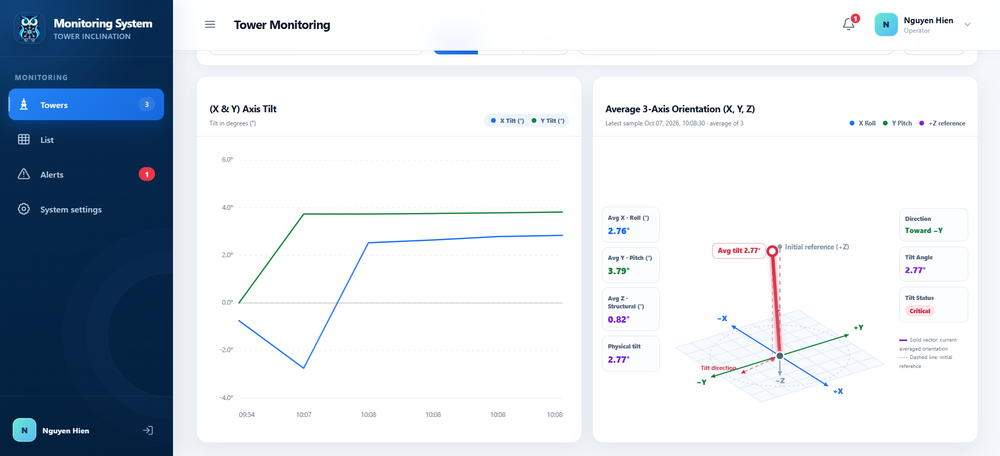
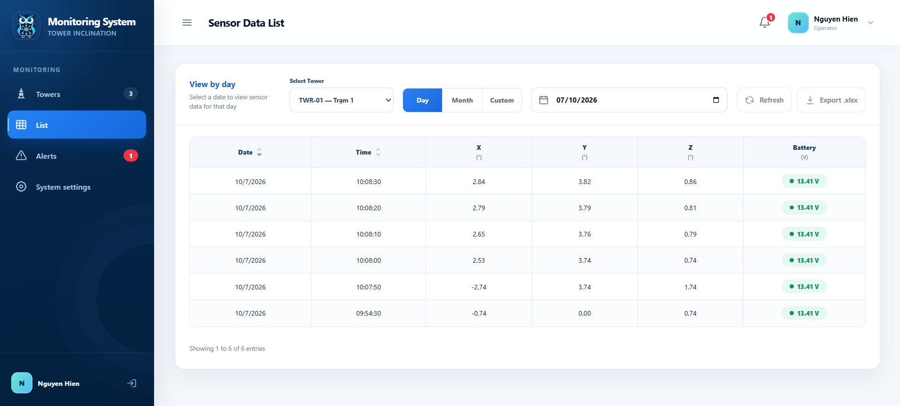
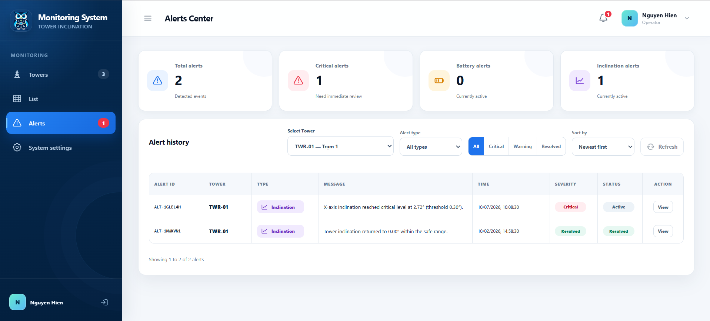
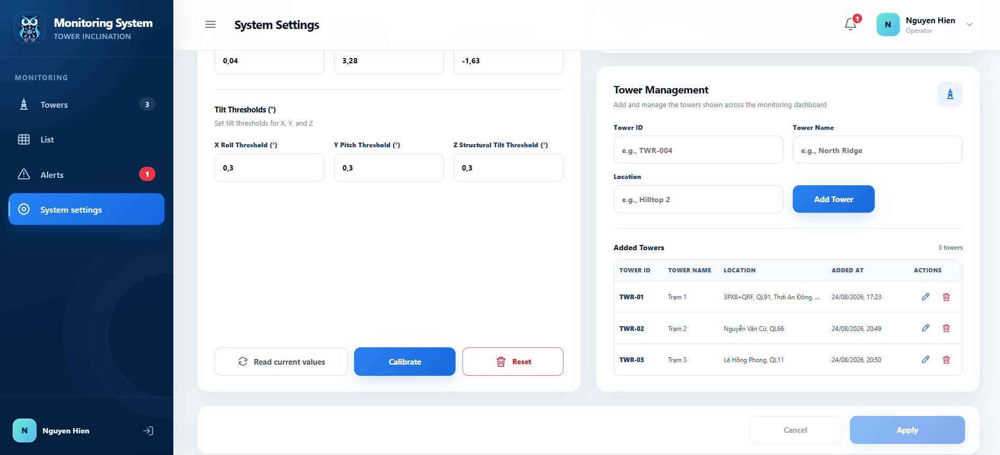

# Tower Inclination Monitoring System

- **Developer:** Pham Ngoc Luat (Project Leader)
- **Developer:** Tran Huu Danh
- **Developer:** Tran Nguyen Hien
- **Developer:** Tran Thanh Quang
- **Major:** Electronics and Communication Engineering
- **Institution:** Can Tho University
- **Email:** pnluat@ctu.edu.vn

---

## Project Overview

**Tower Inclination Monitoring System** is an IoT-based structural health monitoring and early warning solution engineered specifically for **high-voltage power transmission towers**.

Utilizing long-range wireless communication (LoRa) and edge sensing nodes, the system continuously tracks key operational metrics directly from the tower structures:
- **3-Axis Inclination ($X, Y, Z$):** Real-time observation of static tilt angles and structural deformations, allowing early detection of foundation subsidence, soil erosion, or storm-induced stress.
- **Battery & Power Supply Voltage:** Continuous telemetry of battery voltage to guarantee uninterrupted operation of remote solar/battery-powered sensor nodes.
- **Multi-Channel Alerting:** Real-time visual alerts on the centralized web dashboard coupled with automated emergency notifications (via EmailJS) dispatched immediately to maintenance engineers whenever safety limits are exceeded.

---

## Web Interface

### 1. Tower Monitoring
Visualizes tilt trends over time and provides an interactive 3D vector orientation model displaying the exact physical deflection direction of the transmission tower.



---

### 2. Sensor Data List
Presents validated telemetry logs (Date, Time, $X, Y, Z$ angles, Battery voltage) with flexible filtering options by Day, Month, or Custom Date Range, along with direct Excel (`.xlsx`) report export.



---

### 3. Alerts Center
Consolidates and tracks active and historical threshold-violation episodes. Accurately categorizes events by severity (**Critical**, **Warning**) and operational status (**Active**, **Resolved**).



---

### 4. System Settings & Tower Management
Enables administrators to manage registered high-voltage towers across transmission lines, perform sensor baseline calibration, and configure custom alert thresholds for each axis.



---

## Project Structure

```text
Tower_inclination_monitoring_system/
│
├── index.html                   # Main application web dashboard
├── sign-in.html                 # User authentication interface
│
├── css/                         # UI stylesheets (Dashboard, Alerts, Towers, etc.)
├── js/                          # Frontend core logic, 3D vector rendering, and charts
├── supabase/                    # Supabase backend schema and Edge Functions
├── google-apps-script/          # Google Sheets telemetry ingestion and EmailJS service
├── Document/                    # Technical documentation, system diagrams, and assets
│   └── Image/                   # Web interface screenshots and hardware images
└── assets/                      # Icons, logos, and visual assets
```
